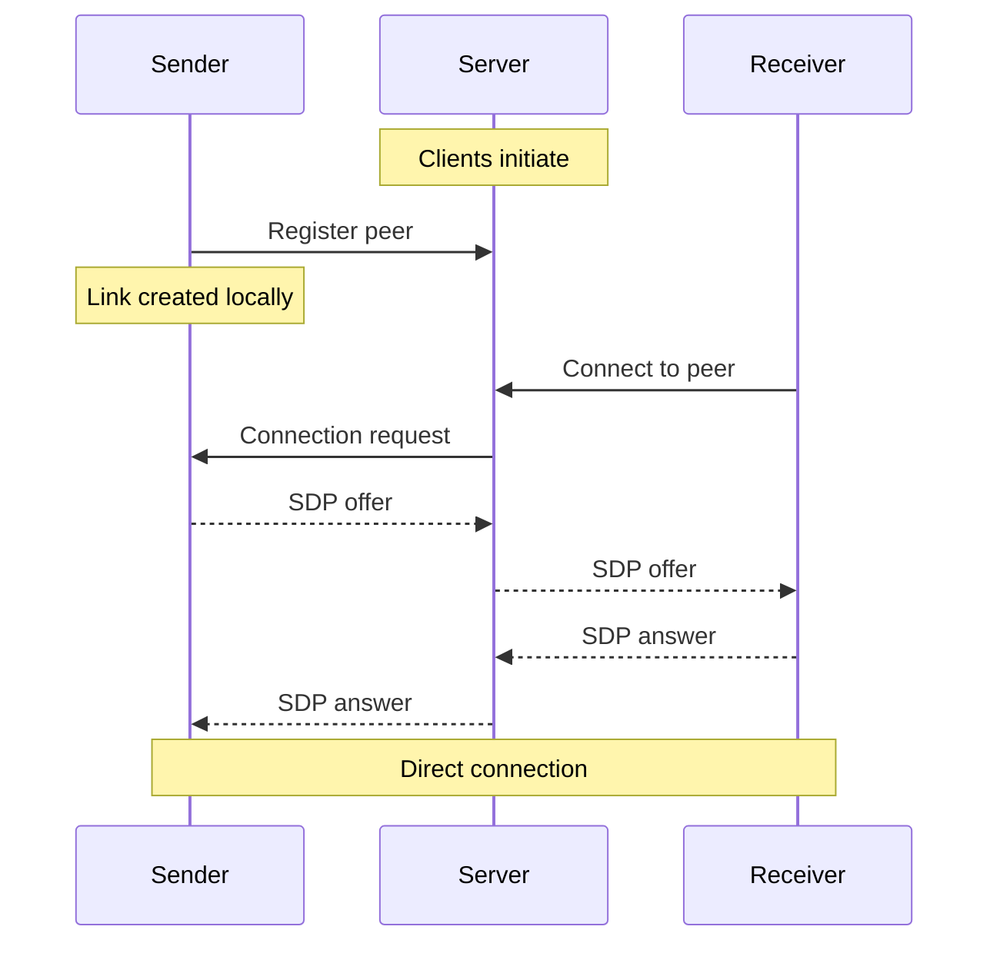
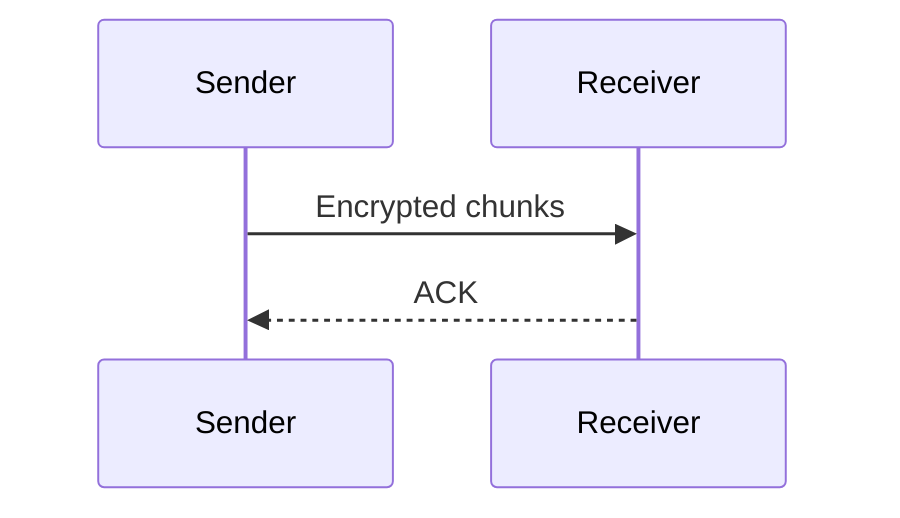

# send.me.it

Peer-to-peer file transfer with a 90s web aesthetic. Uses [WebRTC](https://webrtc.org/) for direct browser-to-browser transfers.

## How It Works

The process is split into two parts:

### Part 1: Setup (server involved)



### Part 2: Transfer (direct, no server)



## Security

The server handles the handshake (Part 1) then steps aside. File transfers (Part 2) go directly between browsers. WebRTC [natively requires DTLS encryption](https://developer.mozilla.org/en-US/docs/Glossary/DTLS#:~:text=All%20of%20the%20WebRTC%20related%20protocols%20are%20required%20to%20encrypt%20their%20communications%20using%20DTLS%3B%20this%20includes%20SCTP%2C%20SRTP%2C%20and%20STUN%2E), so files are safe in transit.

## Development Setup

```bash
npm install
npm run dev
```

Open http://localhost:8080

## Deployment Setup via Docker

```bash
docker compose up --build
```

## Usage

1. Drag and drop a file
2. Share the generated link
3. Recipient opens link to receive file

## Architecture

- Frontend: HTML + CSS + JavaScript
- Backend: Node.js + Express + PeerJS
- File transfer: See [How It Works](#how-it-works) above

## Ports

- 8080: Frontend
- 9000: PeerJS signaling

## License

AGPL-3.0 - See [LICENSE](LICENSE) for details.
